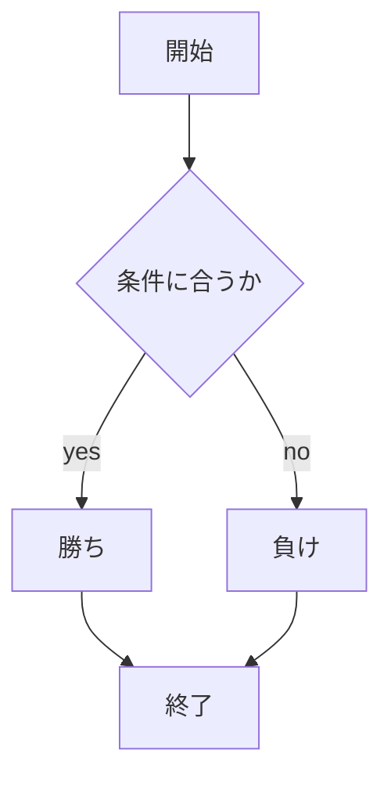
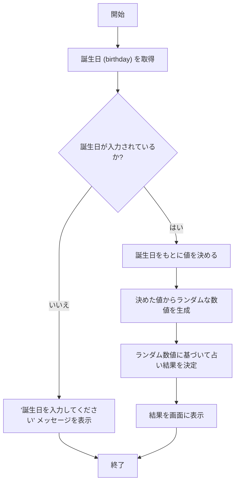

# webpro_06

## このプログラムについて

## ファイル一覧
ファイル名　|　説明
-|-
app5.js | プログラム本体
public/janken.html | じゃんけんの開始画面
views/janken.ejs | じゃんけんのテンプレートファイル
public/uranai.html | 誕生日占いの開始画面
views/fortune.ejs | 誕生日占いのテンプレート
views/persnality.ejs | 性格診断のテンプレート

## プログラムについての説明

誕生日占いのプログラムでは,誕生日からランダムな数値を生成し,その値に基づいて占い結果を決定する.

性格診断のプログラムでは,(A,B,C,D,E)の回答に応じて異なる診断結果を決定する．
未選択の場合は「選択肢を選んでください」と表示.
## 使い方
### じゃんけんの遊び方
1. app5.jsを起動する
1. Webブラウザでhttp://localhost:8080/janken にアクセスする
1. 自分の手を入力する


### 誕生日占いの遊び方
1. app5.jsを起動する
1. Webブラウザでhttp://localhost:8080/fortune にアクセスする
1. 自分の誕生日を入力する

### 性格診断の遊び方
1. app5.jsを起動する
1. Webブラウザでhttp://localhost:8080/personality にアクセスする
1. 自分に合う選択肢を選ぶ

### じゃんけんのフローチャート



### 誕生日占いのフローチャート




### 性格診断のフローチャート
```mermaid
flowchart TD;
  start["開始"];
  getAnswer["回答を取得"];
  checkAnswer{"回答が入力されているか?"};
  noInput["'選択肢を選んでください' メッセージを表示"];
  decideResult["回答に基づき診断結果を決定"];
  showType["診断結果を EJS テンプレートに渡して画面に表示"];
  finish["終了"];
  start --> getAnswer;
  getAnswer --> checkAnswer;
  checkAnswer -->|いいえ| noInput;
  checkAnswer -->|はい| decideResult;
  decideResult --> showType;
  noInput --> finish;
  showType --> finish;
  ```